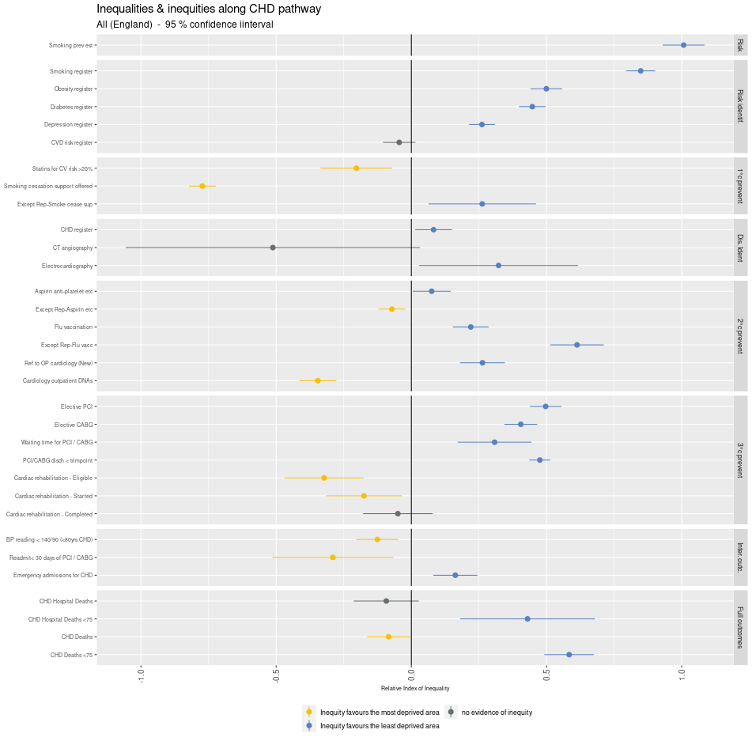

<!-- README.md is generated from README.Rmd. Please edit that file -->

# visualising-inequalities

<!-- badges: start -->
<!-- badges: end -->

This repository is aimed at sharing the R code underlying the joint
Strategy Unit / British Heart Foundation (BHF) project to visualise
socio-economic inequalities along the CHD pathway

The project included development of a new tool, built using Shiny and
aimed at helping Integrated Care Boards (ICBs) get an overview of the
points on the care pathway where inequalities emerge and are amplified.

In this repository we aim to provide key sections of code to facilitate
re-use on similar projects.

The first section of published code is the RII calculations.

The input data for this stage of the process is the rds
activity_by_type_decile_stg1_testdata.rds

This data has a row for each IMD decile. The first column is the IMD
decile number, the second column is the total GP list size for that
decile. Each of the other columns is the total activity for that metric
and decile. In this example there are 32 metrics.

This test dataset has been created using a random number generator with
data items in a range similar to the original dataset.

The second section of code to be published will be the calculations that
assign GP practices into IMD deciles

The tool is available here:
<https://connect.strategyunitwm.nhs.uk/content/b05b649b-511d-4921-9069-2a7a62d694dd/>

The accompanying report including methodology and a recording of a
webinar about the tool is available here:
<https://www.bhf.org.uk/-/media/files/publications/research/bhf_visualising-socio-economic-inequalities-in-chd-progression-and-pathways_sept2022.pdf?rev=e43c10defd7a4579a2795887d6728b37&hash=C3933086783DC0E35F4341FEADD087DA>

Here is an example of the visualisation used in the tool to display the
data generated using these calculations

